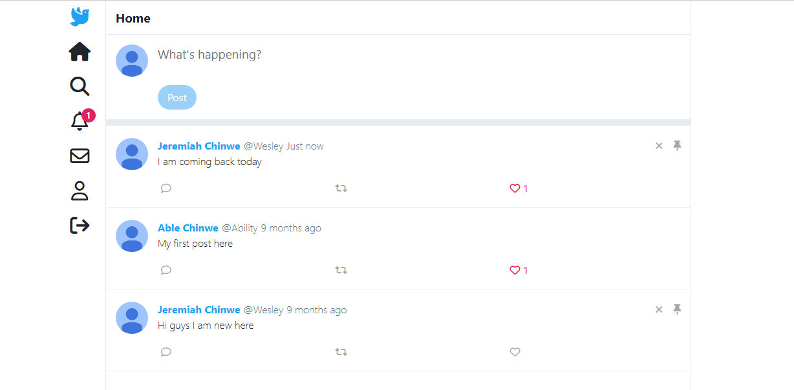

# Full Stack Twitter Clone Personal Project

## Screenshot

## Links

- Live Site URL: [Render](https://twitter-clone-fajm.onrender.com)

## The Backend was built With

- Node.js
- Express.js
- Socket.io
- Mongo DB
- Session-based authentication

## While the Frontend was built with

- Vanilla JavaScript
- JQuery
- Pug for rendering pages
- Bootstrap
- Ajax for data fetching

## Author

- LinkedIn - [@JeremiahChinwe](https://www.linkedin.com/in/jeremiah-chinwe-057180268)
- Twitter - [@jeremiahchinwe](https://www.twitter.com/jeremiahchinwe)

